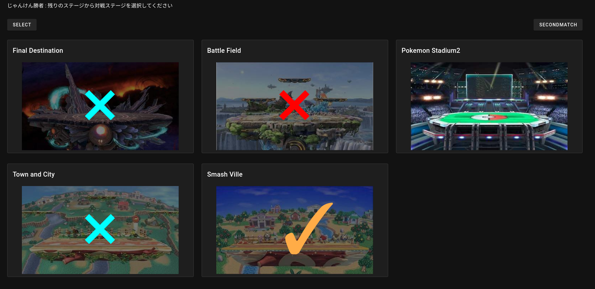

# smash-bros-stage-select-app

 
大乱闘スマッシュブラザーズSPで使われるステージ選択アプリを作りました。

url : [https://smash-bros-stage-select-app.web.app/](https://smash-bros-stage-select-app.web.app/)
 
 ステージ画像の引用 : [https://www.smashbros.com/ja_JP/stage/index.html](https://www.smashbros.com/ja_JP/stage/index.html)
# DEMO
 
画面上の指示分に従って拒否ステージを選択した状態でSELECTボタンを押します

1試合目は5ステージ2試合目以降は7ステージなので右上のSECONDMATCHボタンを押すことで7ステージの中から選択することができます。


 
# Requirement
 
* vue
* vuetify
 
# Installation
 

 
```bash
$ npm install
```
 
# Usage

```bash
$ npm run serve
```
# Hosting

This page is hosted by firebase.
